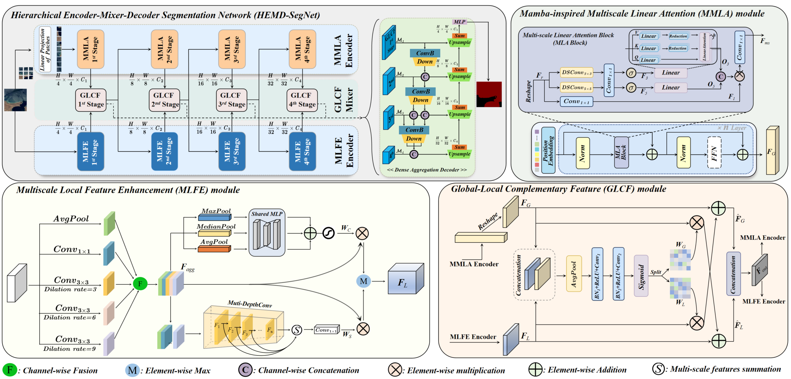

# HEMD-SegNet: A Hierarchical Encoder-Mixer-Decoder Segmentation Network for Extracting lakes from Remote Sensing Images

<p align="center">
    
</p>

> <h2>The complete model code will be made public successively after the paper is accepted for publication.</h2>

## Installation

An example (works for me): ```CUDA 10.1``` and  ```pytorch 1.6.0```

```
pip install -U openmim
mim install mmcv-full
cd HEMDSegNet && pip install -e . --user
```

## Datasets Preparation

The structure of datasets are aligned as follows:
```
SW or QTPL
├── annotations
│　　├── training
│　　└── validation
├── binary_annotations
│　　├── training
│　　└── validation
└── images
 　　├── training
　 　└── validation
```

The SW dataset is freely available for download [here](https://aistudio.baidu.com/aistudio/datasetdetail/75148).

The QTPL dataset is freely available for download [here](http://www.ncdc.ac.cn/portal/metadata/b4d9fb27-ec93-433d-893a-2689379a3fc0).

Example: split ```Surface Water``` to training and testing sets:
```python
python tools/data_split.py --dataset_type sw --dataset_path /path/to/your/surface_water/train_data --save_path /path/to/save/dataset
```

Example: split ```Qinghai-Tibet Plateau Lake``` to training and testing sets:
```python
python tools/data_split.py --dataset_type qtpl --dataset_path /path/to/your/LakeWater --save_path /path/to/save/dataset
```


## Training

We use 1 GPU for training by default. Make sure you have modified the `data_root` variable in [sw_256x256.py](local_configs/_base_/datasets/sw_256x256.py) or [qtpl_256x256.py](local_configs/_base_/datasets/qtpl_256x256.py).

Example: train ```HEMDSegNet``` on ```Surface Water```:

```python
python tools/train.py local_configs/HEMDSegNet/HEMDSegNet-sw.py
```

## Evaluation
To evaluate the model. Make sure you have modified the `data_root` variable in [sw_256x256.py](local_configs/_base_/datasets/sw_256x256.py) or [qtpl_256x256.py](local_configs/_base_/datasets/qtpl_256x256.py).

Example: evaluate ```HEMDSegNet``` on ```Surface Water```:

```python
python tools/test.py local_configs/HEMDSegNet/HEMDSegNet_sw.py local_configs/pretrained_models/HEMDSegNet_sw.pth --eval mIoU mFscore
```

## FLOPs

To calculate FLOPs for a model.

Example: calculate ```HEMDSegNet``` on ```Surface Water```:

```python
python tools/get_flops.py local_configs/HEMDSegNet/HEMDSegNet_sw.py --shape 256 256
```

## Acknowledgment

Our implementation is mainly based on [MMSegmentaion](https://github.com/open-mmlab/mmsegmentation/tree/v0.30.0), [Segformer](https://github.com/NVlabs/SegFormer) and [Mamba](https://github.com/state-spaces/mamba). Thanks for their authors.


## LICENSE


This repo is under the Apache-2.0 license. For commercial use, please contact the authors.
